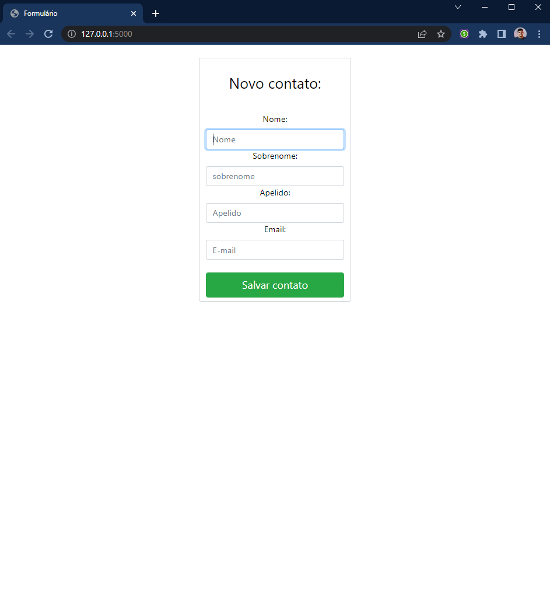

# Cadastro de contatos

Criando um simples formulário para "cadastro de contatos" usando Flask e Bootstrap.


**Bibliotecas usadas:**

* Flask
* Flask-WTF
* Bootstrap



**HTML:**

```html
<!DOCTYPE html>
<html lang="pt-br">

<head>
    <meta charset="UTF-8">
    <meta name="viewport" content="width=device-width, initial-scale=1.0">

    <title>Formulário</title>
    <link rel="stylesheet" href="{{ url_for('static', filename='css/bootstrap.min.css') }}">
    <link href="https://cdn.jsdelivr.net/npm/bootstrap@5.3.0/dist/css/bootstrap.min.css" rel="stylesheet"
        integrity="sha384-9ndCyUaIbzAi2FUVXJi0CjmCapSmO7SnpJef0486qhLnuZ2cdeRhO02iuK6FUUVM" crossorigin="anonymous">
    <link rel="stylesheet" href="https://maxcdn.bootstrapcdn.com/bootstrap/4.0.0/css/bootstrap.min.css">

</head>

<body class="text-center">

    <div class="container">
        <div class="row align-items-center justify-content-center">
            <div class="col-md-4">
                <br />
                <form class="form-control" style="color: black;">

                    {{ info.hidden_tag() }}
                    <br />
                    <h1 class="h3 mb-3 font-weight-normal">Novo contato:</h1>
                    <br />

                    {{ info.nome.label() }}
                    {{ info.nome(class="form-control", placeholder="Nome") }}

                    {{ info.sobrenome.label() }}
                    {{ info.sobrenome(class="form-control", placeholder="sobrenome") }}

                    {{ info.apelido.label() }}
                    {{ info.apelido(class="form-control", placeholder="Apelido") }}

                    {{ info.email.label() }}
                    {{ info.email(class="form-control", placeholder="E-mail") }}

                    <br />

                    {{ info.salvar(class="btn btn-lg btn-block btn-success") }}

                </form>
            </div>
        </div>
    </div>


    <script src="{{ url_for('static', filename='js/bootstrap.min.js') }}"></script>
    <script src="https://cdn.jsdelivr.net/npm/@popperjs/core@2.11.8/dist/umd/popper.min.js"
        integrity="sha384-I7E8VVD/ismYTF4hNIPjVp/Zjvgyol6VFvRkX/vR+Vc4jQkC+hVqc2pM8ODewa9r"
        crossorigin="anonymous"></script>
    <script src="https://cdn.jsdelivr.net/npm/bootstrap@5.3.0/dist/js/bootstrap.min.js"
        integrity="sha384-fbbOQedDUMZZ5KreZpsbe1LCZPVmfTnH7ois6mU1QK+m14rQ1l2bGBq41eYeM/fS"
        crossorigin="anonymous"></script>

</body>

</html>
```

**Python:**

* default.py

```python
from flask import render_template

from app import app
from app.models.info import Info


@app.route("/")
def form():
    info = Info()
    return render_template("forms.html", info=info)
```

* info.py
```python

from flask_wtf import FlaskForm
from wtforms import StringField, SubmitField
from wtforms.validators import DataRequired, Email, Length


class Info(FlaskForm):
    nome = StringField(label="Nome: ", validators=[Length(min=2, max=30), DataRequired()])
    sobrenome = StringField(label="Sobrenome: ", validators=[Length(min=2, max=30), DataRequired()])
    apelido = StringField(label="Apelido: ", validators=[Length(min=2, max=30), DataRequired()])
    email = StringField(label="Email: ", validators=[Email(), DataRequired()])
    salvar = SubmitField(label="Salvar contato")
    
```